# Customer Data Model - Entity Relationship Diagram

## Overview
This ER diagram shows the comprehensive customer data model for Curology, including the central fact table and all supporting dimension tables.

## ER Diagram

```mermaid
erDiagram
    %% FACT TABLE (CENTER OF STAR SCHEMA)
    FACT_CUSTOMER {
        varchar customer_sk PK "Surrogate Key"
        integer curology_user_id UK "Aurora users.id"
        varchar shopify_customer_id "Shopify ID"
        varchar bigcommerce_customer_id "Legacy BigCommerce ID"
        varchar recharge_customer_id "Recharge subscription ID"
        varchar ordergroove_customer_id "OrderGroove ID"
        varchar email "Primary email"
        varchar phone_number "Phone number"
        varchar first_name "First name"
        varchar last_name "Last name"
        date date_of_birth "Date of birth"
        varchar gender "Gender (self-reported)"
        varchar primary_address_sk FK "FK to dim_address"
        varchar geo_region_sk FK "FK to dim_geo_region"
        varchar health_profile_sk FK "FK to dim_health_profile"
        varchar prescribing_provider_sk FK "FK to dim_provider"
        varchar current_subscription_sk FK "FK to dim_subscription"
        varchar payment_method_sk FK "FK to dim_payment_method"
        varchar channel_preference_sk FK "FK to dim_channel_preference"
        boolean is_subscribed "Current subscription status"
        varchar subscription_status "active/paused/canceled"
        integer subscription_tenure_months "Tenure in months"
        varchar hipaa_consent_status "HIPAA consent"
        date customer_created_date "Account creation date"
        date first_consultation_date "First consultation"
        date subscription_start_date "Subscription start"
        date subscription_cancel_date "Subscription cancel"
        date last_order_date "Last order date"
        date last_login_date "Last login"
        integer total_orders_count "Total orders"
        decimal average_order_value "AOV"
        decimal lifetime_value "Customer LTV"
        integer days_since_last_order "Days since last order"
        varchar data_source "Source system"
        varchar run_id "Audit: Run ID"
        timestamp schedule_run_started_at_utc "Audit: Schedule start"
        varchar schedule_trigger "Audit: Trigger type"
        timestamp created_at_utc "Audit: Creation time"
        timestamp data_last_updated "Last update time"
    }

    %% DIMENSION TABLES
    DIM_ADDRESS {
        varchar address_sk PK "Surrogate Key"
        varchar address_line1 "Address line 1"
        varchar address_line2 "Address line 2"
        varchar city "City"
        varchar state "State/Province"
        varchar postal_code "ZIP/Postal code"
        varchar country "Country"
        varchar address_type "shipping/billing/default"
        boolean is_current "Current address flag"
        boolean is_validated "Address validated"
        date effective_date "SCD: Start date"
        date expiration_date "SCD: End date"
        boolean is_active "SCD: Active flag"
        varchar hash "Change detection hash"
        timestamp created_at_utc "Creation time"
    }

    DIM_GEO_REGION {
        varchar geo_region_sk PK "Surrogate Key"
        varchar region_name "Region name"
        varchar state_code "State code"
        varchar state_name "State name"
        varchar country_code "Country code"
        varchar country_name "Country name"
        varchar timezone "Timezone"
        varchar dma_code "DMA code for marketing"
        varchar hash "Change detection hash"
        timestamp created_at_utc "Creation time"
    }

    DIM_HEALTH_PROFILE {
        varchar health_profile_sk PK "Surrogate Key"
        varchar primary_skin_condition "Primary skin condition"
        varchar secondary_skin_conditions "Secondary conditions (JSON)"
        varchar skin_type "Skin type"
        varchar skin_sensitivity "Skin sensitivity"
        varchar known_allergies "Known allergies (JSON)"
        varchar current_medications "Current medications (JSON)"
        varchar past_medications "Past medications (JSON)"
        date first_consultation_completed_date "First consultation date"
        integer total_consultations_count "Total consultations"
        date last_survey_completed_date "Last survey date"
        decimal survey_completion_rate "Survey completion rate"
        date effective_date "SCD: Start date"
        date expiration_date "SCD: End date"
        boolean is_active "SCD: Active flag"
        varchar hash "Change detection hash"
        timestamp created_at_utc "Creation time"
    }

    DIM_PROVIDER {
        varchar provider_sk PK "Surrogate Key"
        integer provider_id UK "user_doctors.id"
        varchar provider_first_name "Provider first name"
        varchar provider_last_name "Provider last name"
        varchar license_type "MD/NP/PA"
        varchar specialization "Medical specialization"
        varchar npi_number "NPI number"
        varchar dea_number "DEA number"
        boolean is_practicing "Currently practicing"
        boolean is_temporary_provider "Temporary assignment"
        varchar hash "Change detection hash"
        timestamp created_at_utc "Creation time"
    }

    DIM_SUBSCRIPTION {
        varchar subscription_sk PK "Surrogate Key"
        varchar subscription_id UK "External subscription ID"
        varchar subscription_source "recharge/ordergroove/shopify"
        varchar plan_type "monthly/quarterly/custom"
        integer renewal_frequency "Renewal frequency (days)"
        integer billing_cycle_start_day "Billing cycle start (1-31)"
        integer billing_cycle_end_day "Billing cycle end (1-31)"
        varchar subscription_status "active/paused/canceled"
        boolean is_vip "VIP status"
        decimal price "Subscription price"
        varchar currency_code "Currency"
        varchar cancel_reason_code "Cancel reason code"
        varchar cancel_reason_description "Cancel reason description"
        boolean is_voluntary_cancel "Voluntary vs involuntary"
        date effective_date "SCD: Start date"
        date expiration_date "SCD: End date"
        boolean is_active "SCD: Active flag"
        varchar hash "Change detection hash"
        timestamp created_at_utc "Creation time"
    }

    DIM_PAYMENT_METHOD {
        varchar payment_method_sk PK "Surrogate Key"
        varchar payment_method_type "card/paypal/insurance"
        varchar payment_processor "stripe/braintree"
        varchar card_brand "visa/mastercard/amex"
        varchar card_type "credit/debit/prepaid"
        varchar card_last_four "Last 4 digits"
        boolean is_default_method "Default payment method"
        date effective_date "SCD: Start date"
        date expiration_date "SCD: End date"
        boolean is_active "SCD: Active flag"
        varchar hash "Change detection hash"
        timestamp created_at_utc "Creation time"
    }

    DIM_CHANNEL_PREFERENCE {
        varchar channel_preference_sk PK "Surrogate Key"
        boolean email_opt_in "Email opt-in"
        boolean sms_opt_in "SMS opt-in"
        boolean app_notifications_opt_in "App notifications"
        boolean phone_contact_opt_in "Phone contact opt-in"
        varchar preferred_contact_method "email/sms/app/phone"
        boolean marketing_opt_in "Marketing opt-in"
        date effective_date "SCD: Start date"
        date expiration_date "SCD: End date"
        boolean is_active "SCD: Active flag"
        varchar hash "Change detection hash"
        timestamp created_at_utc "Creation time"
    }

    %% BRIDGE TABLES (Many-to-Many Relationships)
    BRIDGE_CUSTOMER_ADDRESS {
        varchar customer_sk FK "FK to fact_customer"
        varchar address_sk FK "FK to dim_address"
        varchar address_type "shipping/billing/emergency"
        boolean is_primary "Primary address flag"
        date effective_date "Relationship start"
        date expiration_date "Relationship end"
    }

    BRIDGE_CUSTOMER_PRESCRIPTION {
        varchar customer_sk FK "FK to fact_customer"
        integer prescription_id UK "Prescription ID"
        integer consultation_id "Consultation ID"
        date prescription_date "Prescription date"
        varchar prescription_status "Prescription status"
        varchar formulation_details "Formulation details (JSON)"
    }

    %% RELATIONSHIPS
    FACT_CUSTOMER ||--o{ DIM_ADDRESS : "primary_address_sk"
    FACT_CUSTOMER ||--o{ DIM_GEO_REGION : "geo_region_sk"
    FACT_CUSTOMER ||--o{ DIM_HEALTH_PROFILE : "health_profile_sk"
    FACT_CUSTOMER ||--o{ DIM_PROVIDER : "prescribing_provider_sk"
    FACT_CUSTOMER ||--o{ DIM_SUBSCRIPTION : "current_subscription_sk"
    FACT_CUSTOMER ||--o{ DIM_PAYMENT_METHOD : "payment_method_sk"
    FACT_CUSTOMER ||--o{ DIM_CHANNEL_PREFERENCE : "channel_preference_sk"
    
    %% Bridge table relationships (Many-to-Many)
    FACT_CUSTOMER ||--o{ BRIDGE_CUSTOMER_ADDRESS : "customer_sk"
    DIM_ADDRESS ||--o{ BRIDGE_CUSTOMER_ADDRESS : "address_sk"
    
    FACT_CUSTOMER ||--o{ BRIDGE_CUSTOMER_PRESCRIPTION : "customer_sk"
```



## Key Design Principles

### 1. **Star Schema Design**
- Central fact table (`FACT_CUSTOMER`) contains the grain: one row per customer
- Dimension tables contain descriptive attributes
- Foreign key relationships from fact to dimensions

### 2. **Slowly Changing Dimensions (SCD Type 2)**
- Most dimensions support historical tracking with `effective_date`, `expiration_date`, `is_active`
- Enables tracking changes over time (e.g., address changes, subscription changes)

### 3. **Bridge Tables for Many-to-Many**
- `BRIDGE_CUSTOMER_ADDRESS`: Customers can have multiple addresses
- `BRIDGE_CUSTOMER_PRESCRIPTION`: Customers have multiple prescriptions over time

### 4. **Data Lineage & Audit**
- All tables include audit columns for tracking data lineage
- Hash columns in dimensions for change detection
- Run ID and timestamp tracking

## Source System Mapping

| Dimension | Primary Source | Secondary Sources |
|-----------|----------------|-------------------|
| Customer Base | `aurora_curology.users` | `shopify.customers`, `bigcommerce.customers` |
| Addresses | `shopify.customer_addresses` | `aurora_curology.users`, `ordergroove.addresses` |
| Health Profile | `aurora_curology.consultations` | `survey_check_ins`, `quiz_questions` |
| Provider | `aurora_curology.user_doctors` | - |
| Subscription | `aurora_curology.recharge_subscriptions` | `ordergroove.subscriptions` |
| Payment | `aurora_curology.payment_methods` | `stripe.payment_methods` |
| Prescriptions | `aurora_curology.prescriptions` | `pill_prescriptions` |

## Usage Examples

### Customer 360 View
```sql
SELECT 
    c.customer_sk,
    c.first_name || ' ' || c.last_name as full_name,
    c.email,
    a.city || ', ' || a.state as location,
    h.primary_skin_condition,
    s.subscription_status,
    p.provider_first_name || ' ' || p.provider_last_name as provider_name
FROM fact_customer c
LEFT JOIN dim_address a ON c.primary_address_sk = a.address_sk
LEFT JOIN dim_health_profile h ON c.health_profile_sk = h.health_profile_sk  
LEFT JOIN dim_subscription s ON c.current_subscription_sk = s.subscription_sk
LEFT JOIN dim_provider p ON c.prescribing_provider_sk = p.provider_sk
WHERE c.is_subscribed = TRUE
```

### Address History
```sql
SELECT 
    c.first_name || ' ' || c.last_name as customer_name,
    a.address_line1,
    a.city,
    a.state,
    b.effective_date,
    b.expiration_date,
    b.address_type
FROM fact_customer c
JOIN bridge_customer_address b ON c.customer_sk = b.customer_sk
JOIN dim_address a ON b.address_sk = a.address_sk
WHERE c.customer_sk = 'specific_customer_sk'
ORDER BY b.effective_date DESC
```
